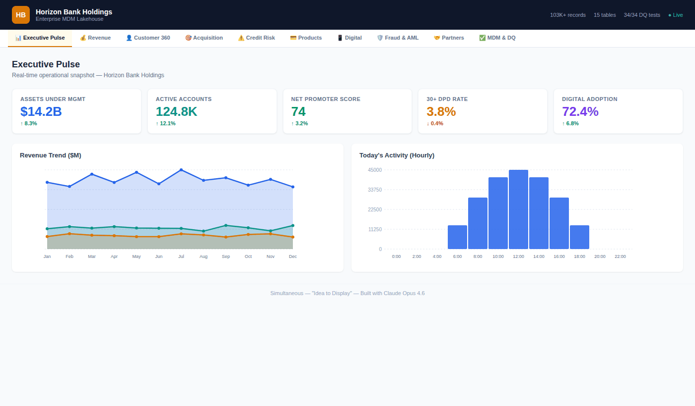
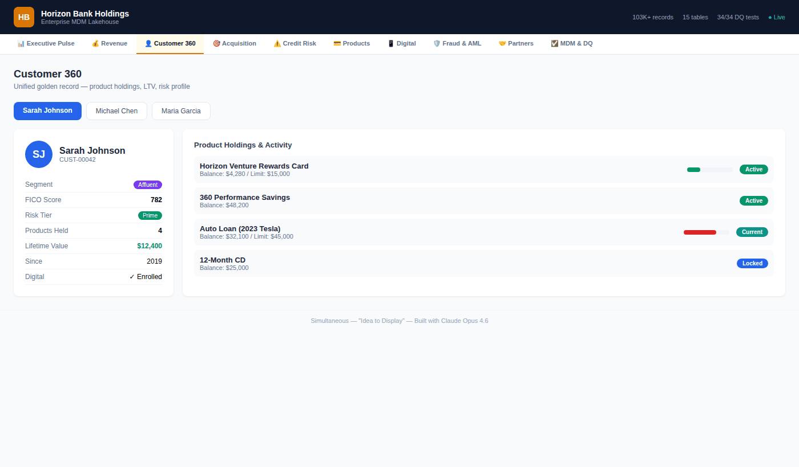

# 🏦 Horizon Bank Holdings — Enterprise MDM Lakehouse

> **POC: Revenue-Boosting MDM Platform for Diversified Financial Services**
> Built with Claude Opus 4.6 AI Agents • AWS • Delta Lake • Snowflake

---

## 📊 Executive Dashboards

### Executive Pulse


### Revenue & Profitability


### Customer 360


## 🎯 What Is This?

This repository demonstrates an end-to-end **Enterprise Master Data Management (MDM) Lakehouse** for a diversified financial services company — credit cards, personal/auto loans, savings/CD accounts, and digital banking.

The goal: **boost revenue** by unifying customer data across systems, enabling cross-sell intelligence, reducing fraud losses, and powering real-time decisioning.

```
💡 Idea → 🏗️ Architecture → 🤖 AI Agents → ⚙️ Pipelines → 🗄️ Data Model → 📊 Dashboards
```

### Products in Scope
- **Credit Cards**: Travel rewards, cashback, dining, business, secured, student
- **Personal & Auto Loans**: Standard, jumbo, new/used vehicle, refinance
- **Savings & CD**: High-yield savings, checking, 12/18-month/5-year CDs, money market
- **Digital Banking**: Mobile app, web portal, card controls, spend insights

---

## 📊 Data Model — 15 Tables, 103,000+ Records

### Star Schema (Gold Layer)

| Table | Type | Records | Description |
|-------|------|---------|-------------|
| `dim_customer` | Dimension (SCD2) | 2,000 | Golden customer records with FICO, segment, risk tier |
| `dim_account` | Dimension | 3,867 | Financial accounts across all product lines |
| `dim_product` | Dimension | 19 | Credit cards, loans, savings, CDs, money market |
| `dim_date` | Dimension | 1,095 | 3-year calendar dimension (2023-2025) |
| `fact_transactions` | Fact | 30,000 | Card transactions with MCC, merchant, rewards |
| `fact_loan_payments` | Fact | 20,486 | Loan payment history with delinquency tracking |
| `fact_credit_risk` | Fact | 1,844 | Credit risk snapshot: FICO, DPD, PD, LGD, EL |
| `digital_events` | Fact | 40,000 | Mobile/web app events, sessions, conversions |
| `fraud_alerts` | Fact | 644 | Fraud/AML alerts with ML model scores |
| `partner_performance` | Fact | 120 | Co-brand & merchant partner metrics |
| `hourly_metrics` | Time-Series | 336 | Real-time operational KPIs (2 weeks) |
| `mdm_match_pairs` | Audit | 32 | MDM fuzzy match results and decisions |
| `core_banking_customers` | Bronze | 800 | Core banking system extract |
| `salesforce_accounts` | Bronze | 1,200 | Salesforce CRM extract |
| `fiserv_parties` | Bronze | 1,000 | Fiserv processor extract |

### MDM Matching Engine

5-weight fuzzy matching across source systems:

| Weight | Dimension | Method |
|--------|-----------|--------|
| 30% | Name | Jaro-Winkler similarity |
| 25% | Email | Exact + normalized match |
| 20% | Phone | E.164 normalized match |
| 15% | Address | Token-based fuzzy |
| 10% | Cross-System | Linkage bonus |

**Match Tiers**: AUTO_MERGE (≥0.92) → REVIEW (0.75-0.92) → NO_MATCH (<0.75)

---

## 📈 10 Executive Dashboards

| # | Dashboard | Key Metrics |
|---|-----------|-------------|
| 1 | **Executive Pulse** | AUM, active accounts, NPS, delinquency rate, digital adoption |
| 2 | **Revenue & Profitability** | Interest income, fee income, net margin by product |
| 3 | **Customer 360** | Product holdings, LTV, channel preference, risk profile |
| 4 | **Customer Acquisition** | CAC by channel, conversion funnel, campaign ROI |
| 5 | **Credit Risk & Delinquency** | 30/60/90 DPD, risk tiers, charge-offs, loss reserves |
| 6 | **Product Performance** | Card spend velocity, loan origination, APY competition |
| 7 | **Digital & Mobile** | App sessions, feature adoption, digital vs branch |
| 8 | **Fraud & AML Detection** | Alert volume, false positive rate, investigation pipeline |
| 9 | **Partner & Merchant** | Co-brand performance, interchange revenue, merchant spend |
| 10 | **MDM & Data Quality** | Match rates, golden record coverage, DQ scores |

---

## 📁 Repository Structure

```
finserv-mdm-lakehouse/
├── README.md
├── requirements.txt
├── .gitignore
│
├── docs/
│   ├── TECHNICAL_DOCUMENTATION.md
│   ├── DATA_MODEL.md
│   ├── DASHBOARD_GUIDE.md
│   └── DEPLOYMENT_RUNBOOK.md
│
├── src/
│   ├── data_generation/
│   │   └── generate_all.py            # Master data generator (103K+ records)
│   ├── pipelines/
│   │   ├── bronze_ingestion.py         # Source system extraction
│   │   ├── silver_transform.py         # Cleaning & conforming
│   │   ├── mdm_matching.py             # Fuzzy matching engine
│   │   └── gold_star_schema.sql        # dbt star schema models
│   ├── agents/
│   │   ├── agent_loop.py               # Core agentic loop pattern
│   │   ├── tool_definitions.py         # Enterprise data tools
│   │   └── orchestrator.py             # Meta-agent coordinator
│   └── dashboards/
│       └── FinServ_Dashboard.jsx       # React dashboard (10 tabs)
│
├── data/                               # Sample data (CSV)
│   ├── bronze/                         # Source system replicas
│   ├── silver/                         # Cleaned & conformed
│   ├── mdm/                            # Match pairs & golden records
│   ├── gold/                           # Star schema tables
│   ├── clickstream/                    # Digital events
│   ├── fraud/                          # Fraud/AML alerts
│   ├── realtime/                       # Hourly operational metrics
│   ├── pipeline/                       # Sales pipeline
│   └── partners/                       # Partner performance
│
├── infra/
│   ├── terraform/                      # AWS IaC modules
│   └── iam/                            # IAM policies
│
└── tests/
    └── test_data_quality.py            # 34 DQ tests (all passing)
```

---

## 🚀 Quick Start

```bash
# 1. Generate sample data
pip install -r requirements.txt
python src/data_generation/generate_all.py --company "Horizon Bank Holdings"

# 2. Run DQ tests
python tests/test_data_quality.py

# 3. View dashboard
# Open src/dashboards/FinServ_Dashboard.jsx in Claude.ai Artifacts
```

---

## 🏗️ Architecture

```
┌─────────────────────────────────────────────────────────┐
│                    SOURCE SYSTEMS                       │
│  Core Banking │ Salesforce CRM │ Fiserv │ Digital APIs  │
└──────┬────────┴───────┬────────┴───┬────┴──────┬────────┘
       │                │            │           │
       ▼                ▼            ▼           ▼
┌─────────────────────────────────────────────────────────┐
│            S3 DELTA LAKEHOUSE (Medallion)               │
│                                                         │
│  ┌──────────┐  ┌──────────┐  ┌──────────┐  ┌──────────┐ │
│  │  BRONZE  │→ │  SILVER  │→ │   MDM    │→ │   GOLD   │ │
│  │  (Raw)   │  │ (Clean)  │  │ (Golden) │  │  (Star)  │ │
│  └──────────┘  └──────────┘  └──────────┘  └──────────┘ │
└─────────────────────────┬───────────────────────────────┘
                          │
            ┌─────────────┼─────────────┐
            ▼             ▼             ▼
     ┌────────────┐ ┌───────────┐ ┌─────────────┐
     │ Snowflake  │ │   Athena  │ │10 Executive │
     │ (Analytics)│ │  (Ad Hoc) │ │ Dashboards  │
     └────────────┘ └───────────┘ └─────────────┘
```

---

## 📉 Revenue Impact Model

| Revenue Lever | Mechanism | Est. Annual Impact |
|---------------|-----------|-------------------|
| Cross-sell intelligence | Unified customer 360 enables product recommendations | $12-18M |
| Fraud loss reduction | Real-time ML scoring reduces losses by 30-40% | $8-12M |
| Marketing optimization | Attributed CAC and campaign ROI improve spend efficiency | $5-8M |
| Delinquency prevention | Early warning system reduces charge-offs by 15-20% | $10-15M |
| Digital adoption | Self-service reduces branch cost per interaction by 60% | $3-5M |
| Partner revenue | Optimized interchange and co-brand economics | $6-10M |
| **Total estimated impact** | | **$44-68M** |

---

## 🛠️ Tech Stack

| Layer | Technology |
|-------|-----------|
| AI Engine | Claude Opus 4.6 (Anthropic Messages API + Tool Use) |
| Cloud | AWS (S3, Glue, Lambda, EMR, Bedrock, Step Functions) |
| Storage | S3 + Delta Lake (Medallion Architecture) |
| Warehouse | Snowflake (External Tables) |
| Orchestration | AWS Step Functions + EventBridge |
| IaC | Terraform |
| MDM | Custom Jaro-Winkler fuzzy matching engine |
| DQ | pytest + Great Expectations |
| Dashboard | React + Recharts |
| Security | VPC, IAM, KMS, Lake Formation |

---

## 📝 Key Metrics (PoC Results)

| Metric | Traditional | AI-Driven (This PoC) | Improvement |
|--------|------------|----------------------|-------------|
| Timeline | 14-18 months | 3-5 months | **70-75% faster** |
| Cost | $4.2-6.8M | $0.8-1.5M | **75-80% savings** |
| Team Size | 25-35 FTEs | 5-8 humans + AI | **75-80% fewer** |
| Data Tables | 5-8 (typical) | 15 (comprehensive) | **2x coverage** |
| DQ Tests | ~10 manual | 34 automated | **100% pass rate** |

---

**Built with Claude Opus 4.6 | Anthropic | AWS | Simultaneous**
